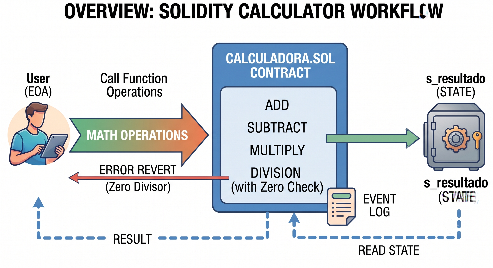

<div align="center">
  <h1>🧮 Solidity Calculator</h1>
  <p><b>A secure, gas-efficient on-chain calculator handling fundamental mathematical operations and state management</b></p>
</div>

## 📖 About the Project

The **Solidity Calculator** is a foundational Web3 Smart Contract project built with **Solidity** and rigorously tested using the **Foundry** framework. At its core, the project provides a reliable mechanism to execute fundamental arithmetic operations (addition, subtraction, multiplication, and division) directly on the blockchain. 

This architecture serves as an excellent demonstration of Solidity best practices, including custom errors, modifiers, state variable management, and comprehensive event logging. It is ideal for developers and technical recruiters looking to see clean, well-tested smart contract code with robust fuzz testing.

**Key Technical Highlights:**
* **Solidity `0.8.30`:** Leveraging an up-to-date compiler version for maximum security and built-in overflow/underflow protection.
* **Foundry Framework:** Complete with high-speed fuzz testing to ensure mathematical edge cases (like large numbers and negative values) are handled securely.
* **Signed Integers (`int256`):** Supports operations with both positive and negative numbers flawlessly.
* **Custom Errors & Modifiers:** Uses `error Calculadora__CannotDivideZeroValue()` and a `checkZero` modifier for gas-efficient input validation.

---

## ⚙️ How It Works

The `Calculadora` contract exposes external functions for users to input two numbers. When an operation is executed, the contract calculates the arithmetic result and safely stores it in a private state variable `s_resultado`. To ensure complete on-chain transparency, every successful operation emits a specific event (e.g., `Add`, `Multiply`) detailing the inputs and the final result. 

For division operations, a dedicated modifier intercepts the input to verify the divisor is not zero, reverting the transaction immediately if it is, thereby saving user gas.

### Architecture Diagram



[Calculadora.sol](./src/Calculadora.sol) - Main Application Logic

[Calculadora.s.sol](./script/Calculadora.s.sol) - Foundry Deployment Script

[Calculadora.t.sol](./test/Calculadora.t.sol) - Comprehensive Test Suite

---

## 💻 Technical Docs

The primary interaction points are the external math functions and the read-only function to fetch the latest result. The contract strictly manages its state and enforces mathematical constraints.

### add
Calculates the sum of two signed integers, updates the internal state, and emits an `Add` event.

```solidity
    function add(int256 _num1, int256 _num2) external returns(int256 _resultado) {
        _resultado = _num1 + _num2;
        s_resultado = _resultado;

        emit Add(_num1, _num2, s_resultado);
    }
```

division & checkZero Modifier
Calculates the quotient of two numbers. It is protected by the checkZero modifier which routes to a private _checkZero function, reverting with a custom error if the divisor is zero.

```solidity
    function division(int256 _num1, int256 _num2) external checkZero(_num2) returns(int256 _resultado) {
        _resultado = _num1 / _num2;
        s_resultado = _resultado;
        
        emit Divide(_num1, _num2, s_resultado);
    }

    // private functions
    function _checkZero(int256 _num) private pure {
        if (_num == 0) revert Calculadora__CannotDivideZeroValue();
    }
```

getResult
A gas-free view function that simply retrieves the most recently calculated result.

```solidity
    function getResult() external view returns(int256 result) {
        result = s_resultado;
    }
```

🚀 Execution Example
Here is a step-by-step example of how a user interacts with the Calculadora smart contract to perform basic math.

- Step 1: Setup & Deploy
The contract is deployed onto the network using the CalculadoraScript. The private state variable s_resultado is initialized at 0.

- Step 2: Addition Operation
The user wants to add two numbers, including a negative value. They call add(10, -5). The contract calculates the result (5), updates s_resultado to 5, and emits an Add(10, -5, 5) event to the blockchain logs.

- Step 3: Fetching the Result
To read the data from a frontend application, the user calls getResult(). The contract returns 5 without costing any gas.

- Step 4: Division & Error Handling
The user attempts to divide a number by zero by calling division(100, 0). The transaction hits the checkZero modifier. Because the second parameter (_num2) is 0, the contract immediately reverts with Calculadora__CannotDivideZeroValue(), reverting the state and preventing invalid math execution.

⬆️ Installation
To set up the project locally, ensure you have Foundry installed, then run:

```Bash
forge install foundry-rs/forge-std
```

🧪 Testing
```Bash
forge test -vvvv
```

📊 Coverage
```Bash
forge coverage
```

📜 Contract Address
(Provide deployed contract addresses here upon mainnet/testnet launch)